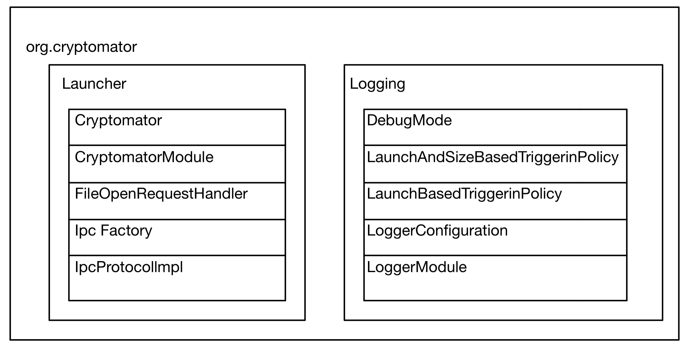
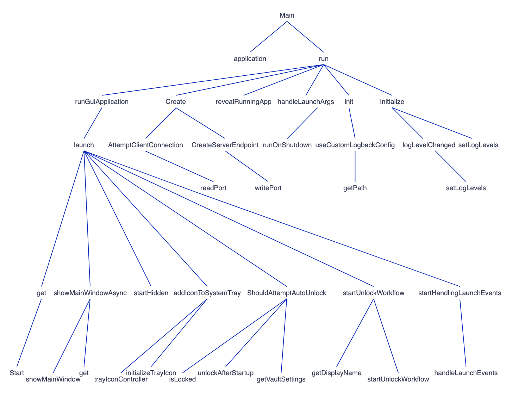
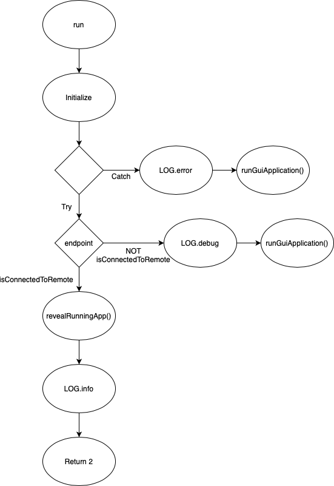
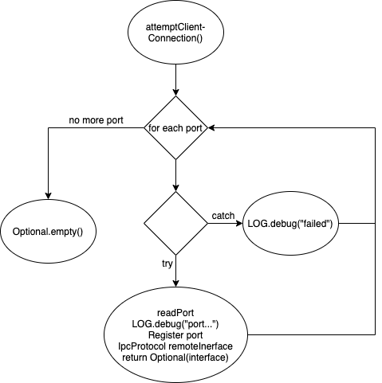
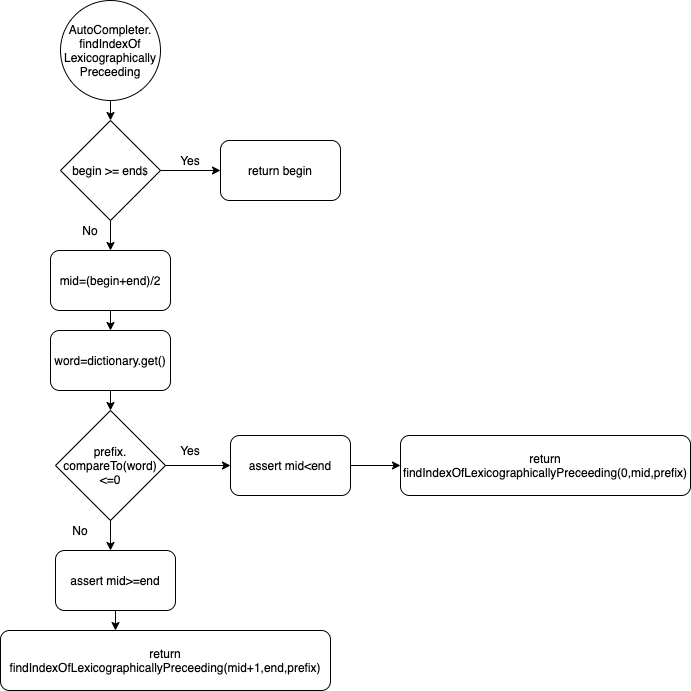
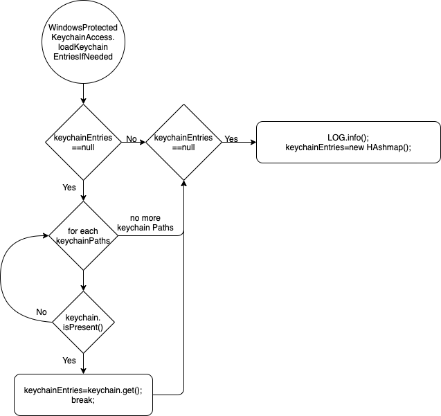
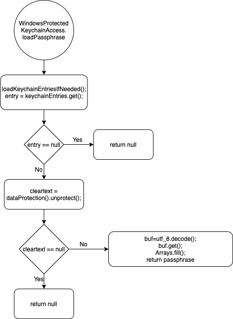
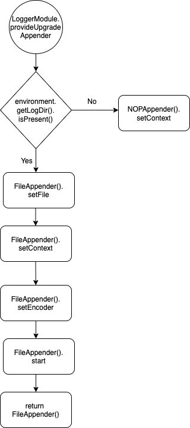

## Software Construction - Assigment 1

- Dubach Rafael (18-755-140)
- Hoffmann Felix (14-591-549)
- Wäspi Raphael (18-918-938)

### PART 1.1 - ARCHITECTURE

We picked the Launcher, logging and org.cryptomator packages in this task to get an overall overview on cryptomator. Since those 3 packages contain exactly 10 classes it was the perfect fit for it. 
### PART 1.2 - CALL GRAPH

### PART 2 - DATA FLOW
####run

####attemptClientConnection

####findIndexOfLexicographicallyPreceeding

####loadKeychainEntriesIfNeeded

####loadPassphrase

####provideUpgradeAppender
